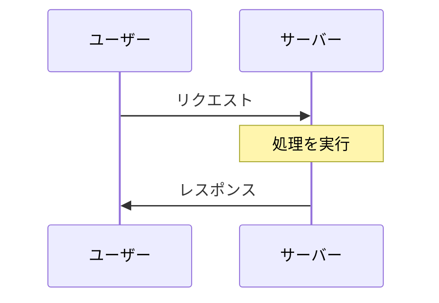
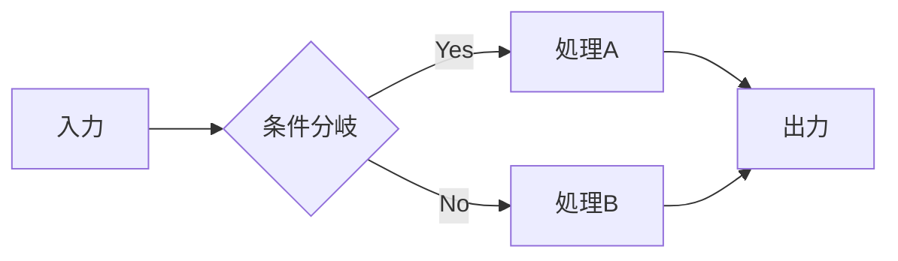

# Qiita記事作成スキル

会話内容を**いいねされやすい**Qiita記事にまとめる。

## 出力先

記事は以下のディレクトリに作成する：

```
~/qiita-article/
```

- ディレクトリが存在しない場合は作成する
- ファイル名は記事の内容を表す英語のケバブケース（例: `mkcert-ssl-explanation.md`）

## 人気記事から学んだ成功パターン

### 1. タイトルの型（8000いいね超の記事から抽出）

**〜を〜したら次にやること系**
- 「AtCoderに登録したら次にやること」(8200いいね)
- 読者の「次どうすればいいの？」に答える

**〜一番分かりやすい〜の説明系**
- 「一番分かりやすいOAuthの説明」(9700いいね)
- 難解な概念をシンプルに

**なぜ〜なのか？系**
- 「なぜエンジニアが作る画面はダサいのか」(8300いいね)
- 読者の疑問・課題に直接アピール

**〜まとめ / 〜選系**
- 「プログラミングでよく使う英単語のまとめ」(12700いいね)
- 「〇〇のオススメ拡張機能24選」(5600いいね)
- 実用的なリスト・チートシート

**数字を入れる**
- 「精選10問」「19個の奥義」「150問」
- 具体的な数字は信頼感とボリューム感を与える

### 2. 構成の特徴

**目次を冒頭に置く**
```markdown
## 目次
| 章 | タイトル | 備考 |
| --- | --- | --- |
| 1. | はじめに | |
| 2. | 基本概念 | ここが重要！ |
...
```

**「はじめに」で読者を惹きつける**
- 背景・動機を1-2段落で
- この記事で何が得られるかを明示
- 対象読者を明確に

**段階的に深掘り**
- 簡単 → 難しい の順序
- 各セクションで完結する価値を提供

**「おわりに」「まとめ」で締める**
- 要点の再確認
- 次のステップの案内
- 関連記事・参考資料へのリンク

### 3. 読みやすさの工夫

**視覚的なメリハリ**
- 見出し（h2, h3）で構造化
- 太字・強調で重要ポイントを目立たせる
- 適度な空行で圧迫感を減らす

**コードは言語指定＋コメント付き**
```python
# ユーザー入力を受け取る
name = input("名前を入力してください: ")
print(f"こんにちは、{name}さん！")
```

**図解・表を活用（Mermaid必須）**
- 比較は表で
- **シーケンス図・フローチャートは必ずMermaidで書く**（ASCIIアートは使わない）
- 概念説明は図があると理解しやすい

Mermaidの例：





**具体例を必ず入れる**
- 抽象的な説明 → 「例えば〜」で具体化
- Before/Afterで効果を可視化

### 4. 信頼感を高める要素

- 実体験・実務に基づいた内容
- 「〇年間〜してきた結果」などの実績
- つまずきポイント・失敗談の共有
- 公式ドキュメントや元記事への参照

## 記事タイプ別テンプレート

### 技術Tips

```markdown
# [技術名]で[やりたいこと]する方法

## はじめに
[課題・背景を1-2文で]

## 環境
- OS: 
- バージョン: 

## やり方

### 1. [ステップ1]
[コード例]
[解説]

### 2. [ステップ2]
...

## ハマりポイント
[自分がつまずいた点とその解決策]

## まとめ
- ポイント1
- ポイント2
- ポイント3

## 参考
- [公式ドキュメント](URL)
```

### ツール紹介

```markdown
# [ツール名]を使ってみたら[メリット]だった

## はじめに
[なぜこのツールを使い始めたか]

## [ツール名]とは
[1-2文で概要]

## インストール
[最短手順]

## 基本的な使い方
[最もよく使う機能を3つ程度]

## 実際の活用例
[自分のユースケース]

## 良かった点・イマイチな点
| 良かった点 | イマイチな点 |
|-----------|------------|
| ... | ... |

## まとめ
[おすすめ度と向いている人]
```

### 学習まとめ

```markdown
# [学んだこと]を理解するためのポイント

## はじめに
[学習の動機・背景]

## 前提知識
[読者に必要な知識レベル]

## 全体像
[図または簡潔な説明]

## ポイント1: [概念]
[説明]
[具体例]

## ポイント2: [概念]
...

## よくある誤解
[初学者がつまずきやすい点]

## 次のステップ
[この先の学習ロードマップ]

## 参考資料
- [書籍/記事/動画]
```

## タグ戦略

人気タグから選ぶ（トレンドより定番が強い）：
- 言語系: Python, JavaScript, Ruby, TypeScript, Go
- フレームワーク: React, Rails, Vue.js, Next.js
- インフラ: AWS, Docker, Kubernetes
- 共通: 初心者, 初心者向け, 入門, Tips, まとめ

3-5個を目安に、「言語/技術」+「レベル/用途」の組み合わせ。

## 出力時のチェックリスト

- [ ] タイトルは具体的で検索されやすいか
- [ ] 「はじめに」で読者の関心を惹けているか
- [ ] 目次または構成が見えるか
- [ ] コードにはすべて言語指定があるか
- [ ] 具体例が含まれているか
- [ ] 1段落が長すぎないか（3-4文以内）
- [ ] 「まとめ」で要点が整理されているか
- [ ] タグ案が3-5個提案されているか
- [ ] **シーケンス図・フローチャートはMermaidで書いているか（ASCIIアート禁止）**